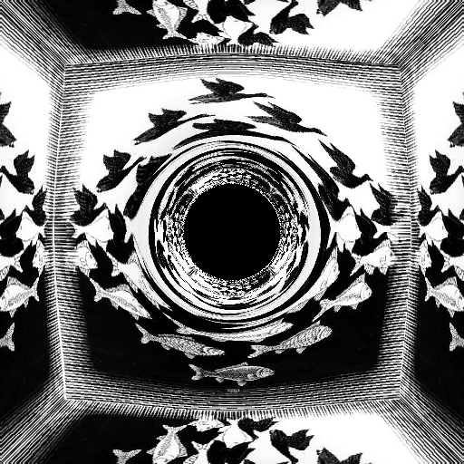
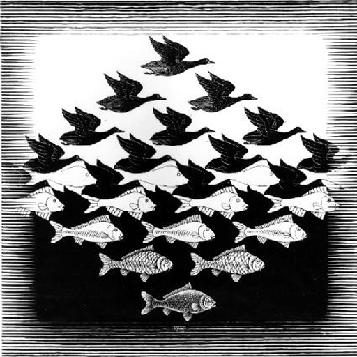

RRT - A numerical kernel for Relativistic Ray Tracing
=====================================================

This program provides a numerical code which simulates the distortion of light induced by a (non-rotating) black hole sitting at the center of a cube which faces are covered by some input image or texture.

It does so by means of the ray tracing technique but with the rays bending according to the so-called Schwarzschild metric (i.e. the solution of Einstein's general relativity field equation for an isolated spherical non-rotating mass).

As such, tracing a ray requires solving the two following differential equations:

in the polar coordinates *phi* and *r*, which is done using the (simple) Euler method.

So this is all (quite) CPU intensive and I therefore (quite) aggressively optimized that code by means of both multithreading (ok this is easy enough as ray tracing, be it in Euclidean or non-Euclidean space, is embarrassingly parallel) as well as SIMD using IA32 SSE extensions. For the later, two rays are processed in parallel within one large SSE register and I even managed to make use of the *sqrtpd* instruction which computes square roots on packed doubles!

The main SSE kernel, which in fine is based on GCC vector extensions (so, hey, it was useful after all ;-), is between lines 494 and 504.

To compile the program rrt-sse.c just do:

    $ ./mak.sh
    ----------------------------------------
    Compiling rrt-sse.c -> ./a-sse
    ----------------------------------------
    Happy crunching!
    $

Here is the log of an execution which produced a 512x512 image on my present (at the time of initial writing) 4 cores laptop (i.e. spawning 4 threads):

    $ time ./a-sse.exe
    Resolution : 512x512
    Loading LW306_512x512.bmp
    Spawning 4 threads
    [100%]
    Thread 0 successfully terminated
    Thread 1 successfully terminated
    Thread 2 successfully terminated
    Thread 3 successfully terminated

    real    1m38.570s
    user    6m19.846s
    sys     0m0.155s
    $
    
The output image is in the file out-sse.bmp (a reference version is provided in file out-sse.512x512-ref.bmp). Naturally, it was hard to choose a picture from someone other than Escher as the texture for the cube faces...   

Here is the ouput:

From the input texture:

    
As I'm afraid I invested much much more on optimization than on user friendlyness, this is (therefore) not a highly user-friendly program... Still, there are a number of parameters which can (pretty) safely be played with.

To change (and have fun experimenting with) the black hole mass, one has to change the following define:

    #define BLACK_HOLE_MASS 4

To change the output image resolution one has to change the following defines:

    #define IMAG_WIDTH 512
    #define IMAG_HEIGHT 512

To change the input image file **(should be a 256 colors indexed BMP)**, one has to change the following defines:

    #define TEXTURE_FILE "LW306_512x512.bmp"
    #define TEXTURE_WIDTH 512
    #define TEXTURE_HEIGHT 512

Last but not least, to change the number of threads, one has to change the following define:

    #define NUM_OF_THREADS 4

To have a computer run at full power, set that number to the number of physical cores of your machine (hyperthreading won't help as we're clearly compute bound here). You may of course increase the output image resolution to have it crunch for long enough (or just to have a nicer picture ;-).

As an example, here is the log of an execution which procuded a 7000x7000 image on a 120 cores SMP computer (a pretty cool machine):

    [root@sdx serverburner]# time ./a-sse
    Resolution : 7000x7000
    Loading LW306_512x512.bmp
    Spawning 120 threads
    [100%]
    Thread 0 successfully terminated
    Thread 1 successfully terminated
    Thread 2 successfully terminated
    Thread 3 successfully terminated
    ...
    Thread 116 successfully terminated
    Thread 117 successfully terminated
    Thread 118 successfully terminated
    Thread 119 successfully terminated

    real    10m13.543s
    user    1129m14.709s
    sys     0m0.721s
    [root@sdx serverburner]#

Almost 19 hours of crunching done in... 10 mins!

As a bonus, the 7000x7000 image is included in this repository (compressed with gzip).

So this is a cool program for getting a little smoke out of your CPUs - and I have now run it on many high-end computers since 2011 (when it was initially written as a late night sofa project) - and it produces nice images in exchange, which I guess is funnier than boring things like just crunching crypto for mining bitcoins ;-)

The code is distributed under the GPL.

Any comments or questions on that code? Just let me know and I'll be happy to help.

Happy crunching!

Chekc out the [official web site](http://sirdeyre.free.fr/maths/relativity.htm)|