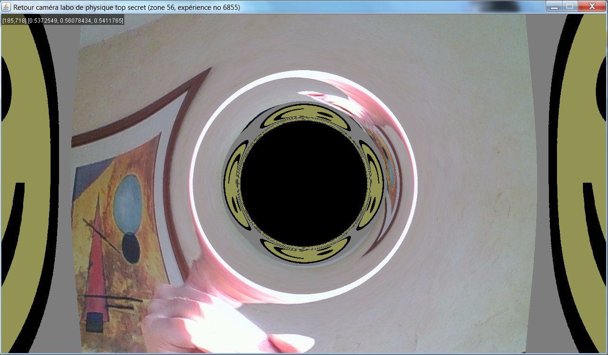
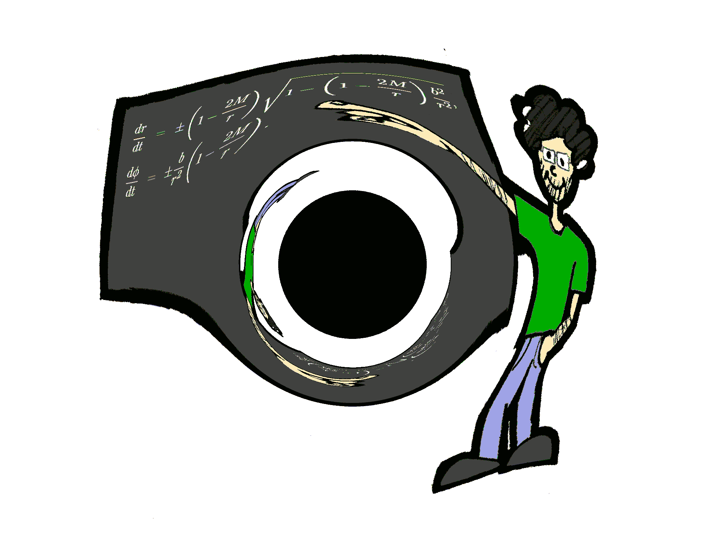

Here is a... Real-time Schwarzchild metric viewer!
==================================================

Just type run.sh and your webcam input will be fed behind a black hole on the far away face of a cubic box which otherwise has a smiley painted on its other faces (hence the multiple distorted smiley images). In the simulation setup, the (virtual) camera which "acquires" the displayed image is in the middle of the closer face of the cube, itself also painted with a smiley.

With a little bit of training, it is even possible to create Einstein rings by just pointing your finger at the black hole (as below ;-).

Enjoy !

You can also check out the [web site](http://sirdeyre.free.fr/maths/relativity.htm)...